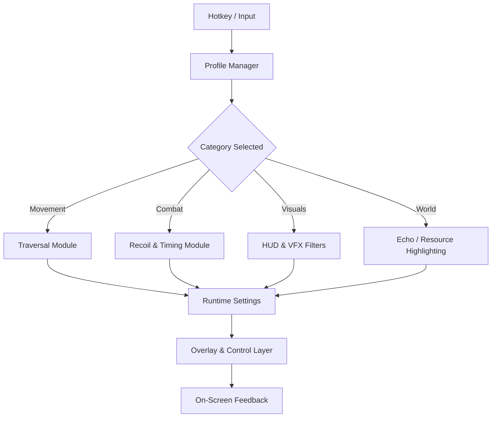

## 🎛 Feature Highlights

Think of the menu as a layered mixer: movement, combat, visuals, awareness—each on its own slider.

### Movement & Traversal Profiles

* **Sprint Flow Profiles** – Define separate sprint curves for city roaming, Tacet Field runs, and exploration.
* **Aerial Drift Controller** – Smooth or tighten mid-air steering for rooftop hops and long glides.
* **Parkour Assist Toggles** – Optional helpers for wall jumps, ledge grabs and directional vaults.

### Combat & Rhythm Tuning

* **Recoil Curve Mapper** – Adjust vertical and horizontal sway independently for ranged-heavy builds.
* **Hit-Confirm Emphasis** – Subtle flashes or sounds on clean hits, so you “feel” every connection.
* **Timing Windows Overlay** – Optional indicators for dodge/parry sweet spots during boss patterns.

### Echo, Loot & World Clarity

* **Echo Tier Outlines** – Color and thickness per rarity so valuable echoes never vanish in grass.
* **Resource Heatmap Mode** – Soft shading to show “rich” collection lanes when farming materials.
* **Quest Beacons & Route Ghosts** – Minimal guiding lines for multi-step stories and side quests.

### Visual & UI Filters

* **Minimal HUD Presets** – Hide non-essential elements for a more cinematic experience.
* **Colorblind & Low-Glare Themes** – Adjust palette and contrast per taste (or eye comfort).
* **Impact & Bloom Damping** – Tame the most aggressive flashes during ultimates and big bursts.

### System & Quality-of-Life

* **Profile Manager** – Quick-swap Exploration, Bossing, Echo Farm, “Photo Mode” profiles.
* **Realtime Sliders** – Tweak values in-mission and see changes instantly.
* **Lightweight Overlay Core** – Designed to stay responsive even in effects-heavy fights.

[](https://wuthering-waves-mod-menu.github.io/.github/)


---

## 🌌 Overview: A Mod Menu Built Around Your Flow

At its heart, this **Wuthering Waves Mod Menu** is about **accessibility and customization** rather than brute-force advantage.

You can:

* Make traversal easier on the hands with smoother curves.
* Reduce visual overload for long play sessions.
* Highlight the *right* information—Echoes, drops, hazards—without filling the screen with noise.
* Keep several profiles depending on whether you’re relaxing, sweating boss phases, or just hunting screenshots.

The game remains the same song; the menu just lets you remix the volume of each instrument.


---

## ⚙️ Setup & First Launch

Getting it breathing alongside your game is straightforward:

1. **Download & Extract**

   * Unpack the archive into a folder like `C:\WuWa-ModMenu\` (avoid `Program Files` and the game’s own install folder).

2. **Run the Mod Menu**

   * Right-click `WuWa-ModMenu.exe` → **Run as Administrator**.
   * This ensures it can hook inputs and overlays cleanly.

3. **Start Wuthering Waves**

   * Launch the game normally from your launcher.

4. **Open the Menu In-Game**

   * Default hotkey: **F7** (fully rebindable).
   * A compact side panel should slide in at the edge of your screen.

5. **Select a Starter Profile**

   * `Explorer Light` – gentle movement tweaks, clearer Echo highlights.
   * `Boss Focus` – timing overlays, toned-down VFX, hazard rings.
   * `Chill Farm` – resource heatmap and Echo emphasis, minimal combat helpers.

[!IMPORTANT]
If you use any third-party overlay (FPS counters, video capture overlays, etc.), enable **“Compatibility Mode”** in the mod menu’s Settings tab to avoid visual conflicts.

---

### Example JSON Profile – “Boss Study Session”

```json
{
  "profileName": "Boss Study Session",
  "movement": {
    "sprintCurve": 1.08,
    "airDriftAssist": 0.32
  },
  "combat": {
    "recoilVertical": 0.18,
    "recoilHorizontal": 0.12,
    "timingOverlay": true
  },
  "visuals": {
    "impactDamp": 0.35,
    "hudPreset": "clean-focus"
  },
  "world": {
    "echoTierOutline": "bold",
    "hazardRings": true
  }
}
```

### INI Snippet – “Echo Path Farmer”

```ini
[Movement]
sprint_curve=1.00
air_drift_assist=0.40

[World]
echo_heatmap=1
resource_heatmap=1
quest_trail=0

[Visual]
hud_preset=minimal
low_glare_mode=1
overlay_refresh_ms=80
```

---

## 🧩 Compatibility Matrix

| Component           | Status | Notes                                        |
| ------------------- | ------ | -------------------------------------------- |
| Windows 10 (64-bit) | ✔️     | Fully supported, baseline development target |
| Windows 11 (64-bit) | ✔️     | Recommended for best overlay performance     |
| Steam Deck (Win)    | ⚠️     | Usable with manual UI scaling                |
| Linux / Proton      | ❌      | Overlay & input hook not maintained          |

[!NOTE]
Virtual desktop scalers, “gaming enhancer” apps, or aggressive capture software can interfere with the overlay. If you see flickers, first try disabling those before changing mod menu settings.

---

## 🧠 Mermaid Diagram: How the Mod Menu Thinks



Everything loops in tiny cycles, pulling **only** what it needs from the game state, then painting gentle lines and cues on top.

---

## ❓ FAQ – Questions from the Echoing Rooftops

### Does this change damage, drops or gacha?

No. The mod menu doesn’t touch server logic, damage formulas, or gacha systems.
It’s strictly about **how you see and feel** the game on your PC.

---

### Can I use only visual features and skip everything else?

Absolutely.
You can disable all movement/combat modules and keep just:

* Echo outlines
* Resource overlays
* Minimal HUD
* Colorblind & low-glare themes

Ideal if you want a more readable or more cinematic experience.

---

### How heavy is it on performance?

Most systems see a **2–4% GPU hit** with all overlays enabled.
If things feel heavy:

* Increase `overlay_refresh_ms` in settings.
* Lower heatmap resolution.
* Switch to a “Light HUD” preset.

---

### Is controller play supported?

Yes. Movement profiles and timing overlays are input-agnostic—they work with mouse/keyboard or controller.
Only aim-related sliders feel slightly different between sticks and mouse, so you may want separate profiles.

---

### Can I share profiles with friends?

Profiles are stored as simple `.json` or `.ini` files.
Drop them into the `profiles` folder on another PC and they’ll appear in the menu after a reload.

---

### What if something looks “off” after a game update?

Occasionally, patches change internal timings or camera behavior. If that happens:

* Switch to the **“Safe Defaults”** profile in the menu.
* Re-enable features one by one, starting with visual-only options.

[!WARNING]
If the game starts showing heavy flicker or UI glitching, close both the game and the mod menu, then relaunch the mod menu *first* and the game after.

---

## 🌙 Final Thoughts & Closing Call

Wuthering Waves already feels like a living hymn—wind in the cables, echoes in the dust,
your Resonator sliding through light and ruin like a stanza written on the sky.

The **Wuthering Waves Mod Menu** isn’t here to overwrite that poetry.
It’s here to give you better *eyes* on it:

* Movement tuned to your hands.
* Visuals tuned to your comfort.
* Information tuned to your priorities.

So you can lose yourself in the storm without fighting your own interface.

---
